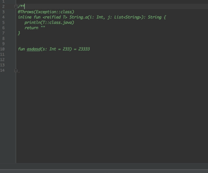
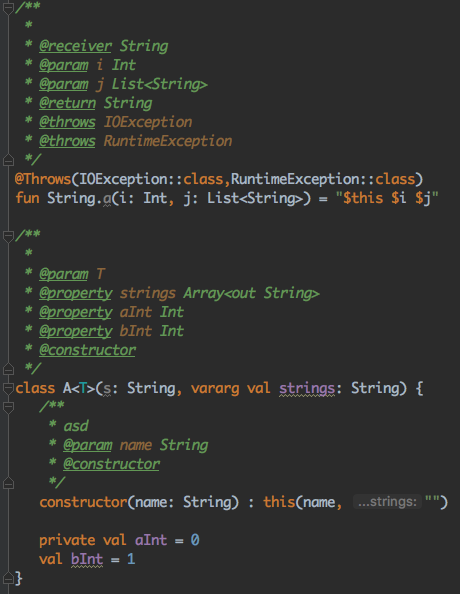
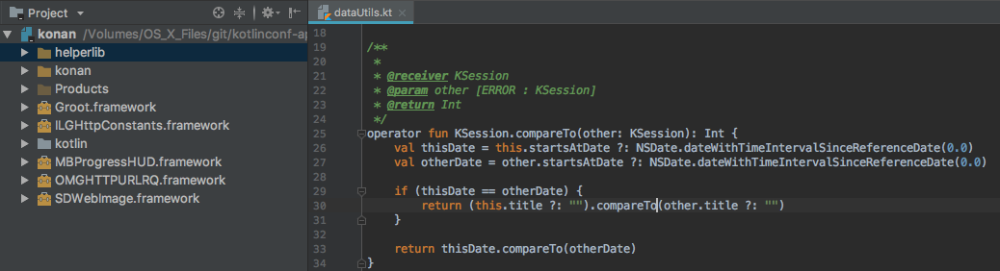
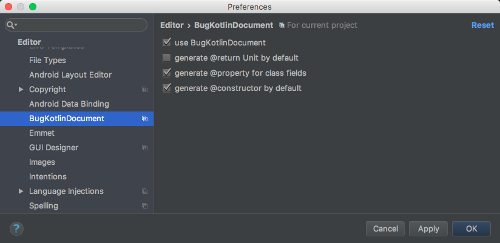

# BugKotlinDocument
Plugin for **IntelliJ IDEA** / **Android Studio** / **CLion**.
And now **AppCode** is available!

- Generate document comments for Kotlin file.
- Just generate it as Java do.

# Usage 

**Just press Enter key like in Java File !!!**

 

# Screenshots
 

## AppCode and CLion support!
  

## Settings

**Settings/Preferences** | **Editor** | **BugKotlinDocument**

 

# Install
Download the release page then install the plugin.

`Preference -> Plugin ->`

- `Install plugin from disk` in Idea/Android Studio
then enjoy Bugs!!!!

- Or `browse repositories` and search `Kotlin`/`Bug`/`Docu` is OK.

# Samples

more samples:

[main.kt](src/test/kotlin/com/github/zxj5470/bugktdoc/samples/main.kt)

[functions.kt](src/test/kotlin/com/github/zxj5470/bugktdoc/samples/functions.kt)

[constructors.kt](src/test/kotlin/com/github/zxj5470/bugktdoc/samples/constructors.kt)

# Projects use this plugin.

- [ice1000/dev-kt](https://github.com/ice1000/dev-kt)
A DevCpp-like cross-platform Kotlin IDE features in lightweight.
- [ice1000/julia-intellij](https://github.com/ice1000/julia-intellij)
Julia Plugin for IntelliJ IDEA
- [zxj5470/ktlext](https://github.com/zxj5470/ktlext)
A useless library for Kotlin extensions. 
